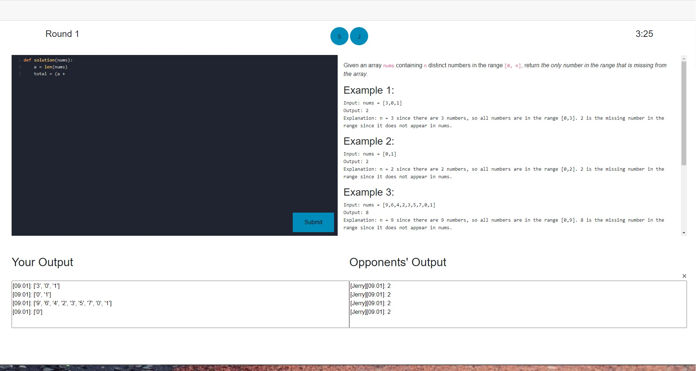

# `coder_royale`

`coder_royale` is an educational programming game. Players race to be the quickest to solve a series of algorithm challenges.

`coder_royale` is a realtime web application built in .NET Core and Blazor. Users submit their code against a database of algorithms and test cases to compete against one another. The Python code is executed in a Docker container on the server where the correctness is checked. Executing the code in a container helps prevent against any malicious uploads since the code never touches the actual server.